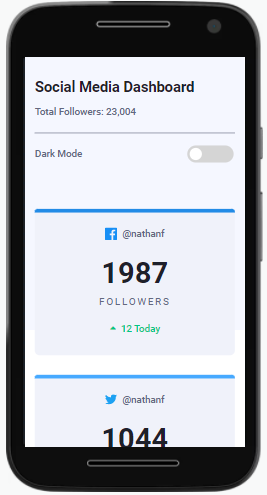
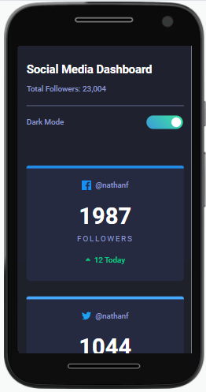

<h1 text-align="center">Social Media Dashboard</h1>

Uma landing page com dados quantitativos de um usuário fictício em redes sociais.

---

Este projeto foi baseado no desafio do <a href="https://www.frontendmentor.io/challenges/social-media-dashboard-with-theme-switcher-6oY8ozp_H">Social Media Dashboard With Theme Switcher</a> da plataforma FrontEnd Mentor.

 <a href="#desafio">O desafio</a> | 
 <a href="#tecnologias">Tecnologias</a> | 
 <a href="#imagens">Imagens</a> | 
 <a href="#links">Links</a> |
 <a href="#redes">Redes</a>

---

### Visão Geral

#### O desafio

O usuário pode:

- Usufruir do layout do aplicativo independente do tamanho da tela (Design Responsivo);
- Escolher entre modo escuro e claro;
- Ver os estados ativos e com foco dos elementos.

---

#### Tecnologias

- HTML5 semântico
- Propriedades CSS customizadas
- Flexbox
- SASS Compiler
- Mobile-first Workflow
- JavaScript

---

#### Imagens

<h4>Modo Claro</h4>

<h4>Modo Escuro</h4>

---
#### Links

- 
<a href="https://oliverids.github.io/socialmedia-dashboard/" target="_blank">Live Site URL</a> (Github Pages) 

#### Redes

Perfil do FrontEnd Mentor - <a href="https://www.frontendmentor.io/profile/oliverids">@oliverids</a>

